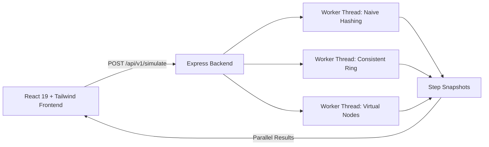

# 01 · Consistent Hashing Simulator

An interactive simulator that compares three key-distribution strategies side by side on identical data: **naive modulo hashing**, **consistent hashing on a ring**, and **consistent hashing with weighted virtual nodes**. Add and remove servers step by step and watch how each strategy handles load balance and key movement in real time.

🔗 **Live Demo:** [https://consistent-hashing-simulator.vercel.app](https://consistent-hashing-simulator.vercel.app)

---

## Why this exists

Consistent hashing is easy to describe and hard to feel. The trade-offs only become obvious when you watch the same sequence of events hit different strategies at the same time:

- **Naive `hash(key) % N`** reshuffles almost every key whenever $N$ changes.
- **A plain hash ring** moves far fewer keys ($\approx 1/N$), but leaves some servers heavily overloaded due to non-uniform arc sizes.
- **Virtual nodes** even out the load across the entire ring, and weighted virtual nodes let bigger servers take a proportionally bigger share.

This project makes those differences measurable and visible.

---

## Features

- **Side-by-side comparison** of three strategies, always showing the same step at the same time.
- **Multi-threaded Backend Simulation**: Runs all three hashing algorithms simultaneously in parallel Node.js **Worker Threads**.
- **Add and remove servers by ID**, with validation against the current cluster state.
- **Per-server capacity** (Low / Normal / High / Custom weight) that scales the number of virtual nodes a server gets.
- **Virtual node resolution** (Low / Medium / High) to show how ring granularity affects balance.
- **Heatmap** of per-server load with hover tooltips, readable with 100+ servers.
- **Stats per strategy**: max keys on a node, max/mean ratio, standard deviation ($\sigma$), and keys moved per step.
- **Timeline chart** of keys remapped per step, with cumulative totals and hover metrics.
- **Interactive Swagger Documentation**: Built-in OpenAPI 3.0 docs for testing simulation APIs directly.

---

## How the strategies differ

| Strategy | How a key is assigned | On adding or removing a server | Load balance |
|---|---|---|---|
| **Naive** | `hash(key) % N` | Almost all keys move ($\approx \frac{N-1}{N}$, often **90%+**), because the divisor $N$ changes | Near perfectly even |
| **Consistent hashing (ring)** | The key goes to the first server clockwise from its hash on the ring | Only the keys of the affected server's arc move, roughly $\approx \frac{1}{N}$ of all keys | Uneven; arc sizes vary and create hotspots |
| **Consistent hashing with virtual nodes** | Each server owns many points on the ring, scaled by its capacity | Moved keys are spread across many neighbors, roughly $\approx \frac{1}{N}$ of all keys | Much tighter; improves as resolution increases |

Virtual nodes per server are computed as:

```
vnodes(server) = max(1, round(resolutionVnodes × capacityWeight))
```

where `resolutionVnodes` is the number of virtual nodes for a normal (weight 1.0) server, and `capacityWeight` is the per-server multiplier.

| Setting | Value |
|---|---|
| **Resolution: Low** | 10 virtual nodes |
| **Resolution: Medium** | 50 virtual nodes |
| **Resolution: High** | 150 virtual nodes |
| **Capacity: Low / Normal / High** | 0.5× / 1.0× / 2.0× |
| **Capacity: Custom** | 0.25× – 8.0× |

The naive and plain ring strategies have no concept of capacity, so they ignore server weights. This is intentional, and it is part of what the comparison shows.

---

## Metrics

| Metric | What it tells you |
|---|---|
| **Keys per node** | Raw key count on each server |
| **Max keys on a node** | How overloaded the hottest server is |
| **Max / mean ratio** | Peak load relative to the ideal even share (1.0 is perfect) |
| **Standard deviation ($\sigma$)** | Overall spread of load across servers |
| **Keys remapped (count & %)** | The cost of a topology change; the ideal on a single add or remove is about $\approx 1/N$ |
| **Cumulative keys moved** | Total migration cost across a whole sequence of operations |

Standard deviation and cumulative totals are computed in the frontend from the per-step data.

---

## Architecture



The backend runs all three strategies in parallel worker threads against the same keys and operation sequence, returning unified per-step snapshots for each strategy.

---

## Tech Stack

- **Frontend:** React 19, JavaScript (ESM), Vite, Tailwind CSS, Recharts, Lucide React
- **Backend:** Node.js, Express 5, Worker Threads (`node:worker_threads`), MurmurHash3 (`imurmurhash`), CORS, Swagger UI Express

---

## Getting Started

All commands below are run from the project root (`01_CONSISTENT_HASHING/`).

### Prerequisites

- **Node.js**: v18.0.0 or higher
- **npm**: v9.0.0 or higher

---

### Backend Setup

```bash
cd backend
npm install
npm run dev
```

- API Server: `http://localhost:8000`
- Interactive Swagger UI: `http://localhost:8000/api/v1/docs`

---

### Frontend Setup

```bash
cd frontend
npm install
npm run dev
```

- Web App: `http://localhost:5173`

---

### Environment Variables

Located in `frontend/.env`:

| Variable | Description | Default |
|---|---|---|
| `VITE_API_BASE_URL` | Base URL of the backend API | `http://localhost:8000` |

---

## Usage

1. Set **Initial servers** (20–128), **Total keys** (1,000–100,000), and **Resolution** (Low/Medium/High) in the sidebar.
2. Use **Add server** or **Remove server** to queue operations:
   - **Add server**: Enter a server ID and select capacity tier (`Low 0.5x`, `Normal 1x`, `High 2x`, or `Custom`).
   - **Remove server**: Filter and select an active server from the searchable dropdown.
3. Press **Play** to execute the simulation. The backend worker threads compute all steps in parallel, and the frontend plays through them step-by-step.
4. Press **Reset** at any time to clear the operations queue and return to Step 0 (`INIT`).

---

## API Reference

### `POST /api/v1/simulate`

Runs parallel simulations across all three strategies and returns step-by-step distributions and statistics.

#### Request Body
```json
{
  "servers": 40,
  "keys": 10000,
  "seed": 42,
  "operations": [
    "ADD 41",
    "ADD 42 2",
    "REMOVE 10",
    "ADD 43 HIGH"
  ]
}
```

| Field | Type | Description |
|---|---|---|
| `servers` | `integer` | Initial number of servers ($20 \le \text{servers} \le 10,000$) |
| `keys` | `integer` | Total number of keys to distribute ($1,000 \le \text{keys} \le 1,000,000$) |
| `seed` | `integer` | Random seed for hashing consistency ($1 \le \text{seed} \le 10,000$) |
| `operations` | `string[]` | Ordered list of operations (`ADD <id> [weight/tier]`, `REMOVE <id>`) |

#### Response (`200 OK`)
```json
{
  "success": true,
  "data": {
    "naive": [
      {
        "step": 0,
        "operation": "INIT",
        "servers": 40,
        "activeServers": [1, 2, 3, "..."],
        "stats": {
          "keysPerNode": { "1": 250, "2": 250 },
          "maxKeysOnNode": 250,
          "meanKeysPerNode": 250.0,
          "remappedKeysCount": 0,
          "fractionRemapped": 0.0
        }
      }
    ],
    "circular": [ "..." ],
    "virtual": [ "..." ]
  }
}
```

---

## Project Structure

```
01_CONSISTENT_HASHING/
├── backend/
│   ├── services/
│   │   ├── naiveService.js        # Naive modulo hashing logic
│   │   ├── circularService.js     # Plain circular ring hashing logic
│   │   └── virtualService.js      # Weighted virtual node hashing logic
│   ├── utils/
│   │   ├── simWorker.js           # Multi-threaded worker runner
│   │   ├── asyncHandler.js        # Async route wrapper
│   │   └── globalErrorHandler.js  # Global error handler
│   ├── controller.js              # Validation and request handling
│   ├── route.js                   # API route definitions
│   ├── swagger.js                 # OpenAPI 3.0 specification
│   ├── server.js                  # Express app & CORS entry point
│   └── package.json
│
├── frontend/
│   ├── src/
│   │   ├── components/
│   │   │   ├── Header.jsx         # App header & Play/Reset controls
│   │   │   ├── Sidebar/           # Settings, Add/Remove composer, Queue log
│   │   │   ├── StrategyColumn/    # Header, banner, stats tiles, heatmap
│   │   │   └── TimelineChart/     # Recharts keys remapped timeline
│   │   ├── hooks/
│   │   │   └── useSimulation.js   # Simulation state and playback hook
│   │   ├── utils/
│   │   │   └── mathUtils.js       # Std dev, ratios, validation utilities
│   │   ├── api.js                 # Backend API client with mock fallback
│   │   ├── mockData.js            # Offline mock simulation dataset
│   │   ├── constants.js           # Strategy metadata & resolution maps
│   │   ├── App.jsx                # Main single-page application layout
│   │   └── index.css              # Dark theme styling & tokens
│   ├── index.html
│   ├── vite.config.js             # Vite config with backend proxy
│   ├── tailwind.config.js
│   └── package.json
│
└── README.md

